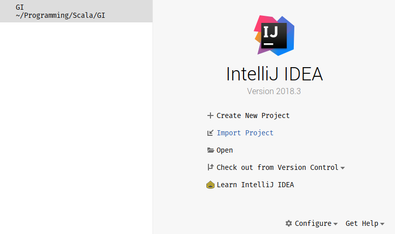
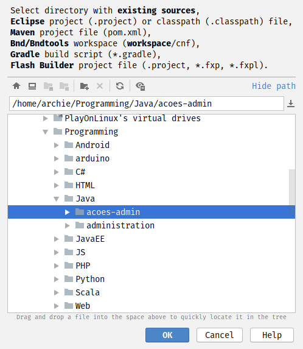
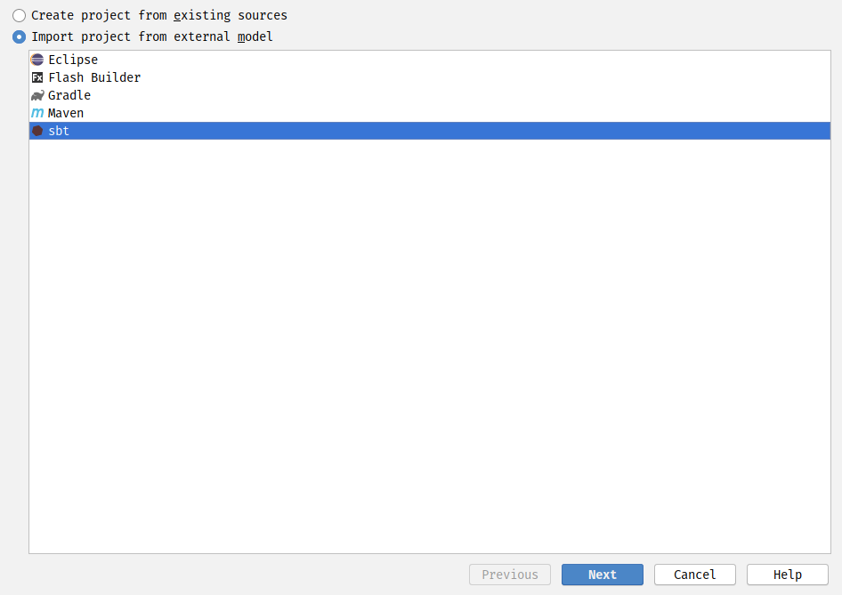
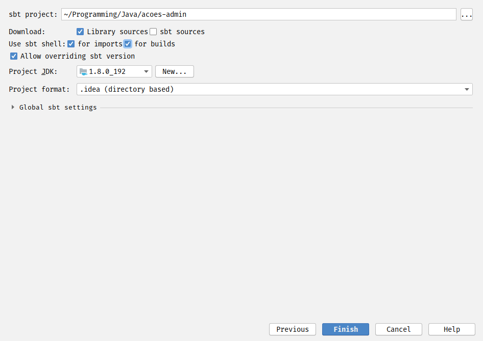
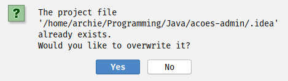
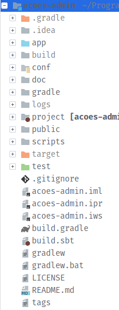

## Running

Run this using [sbt](http://www.scala-sbt.org/). 

```
sbt run
```

## Importing the project

First of choose to import a new project

 

Then select the folder with the project and press `OK`

 

Now choose `Import project from external model` and choose `sbt` and press `Next`

 

Then select the same option as in the following image, and press finish.

Note that the JDK version doesn't have to be the same as mine, but version 1.8 is the one that I have tested



In case that you have the following option press `Yes`



## Compiling and running

After importing you should compile the project. Open `sbt shell` and type `compile`

Then enter `run` and go to `localhost:9000` in your browser.

After all you project structure in IntelliJ IDEA (folder colors) should be like this.

